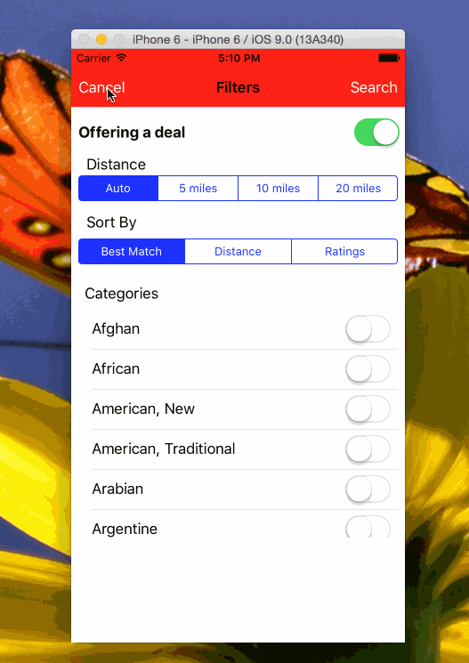

# Yelp

Yelp Application for Homework #3

Time spent: 14 hours

Completed:

* [Done] Search results page: Dynamic Row Heights
* [Done] Search results page: Auto layout of cells
* [Done] Search results page: Search Bar in Navigation bar
* [Done] Filters Page: Filters for deal, sort, categories
* [Done] Navigation between Search Results and Filters
* [Done] Filters results by selected filters

Note: to embed the gif file, just check your gif file into your repo and update the name of the file above.
